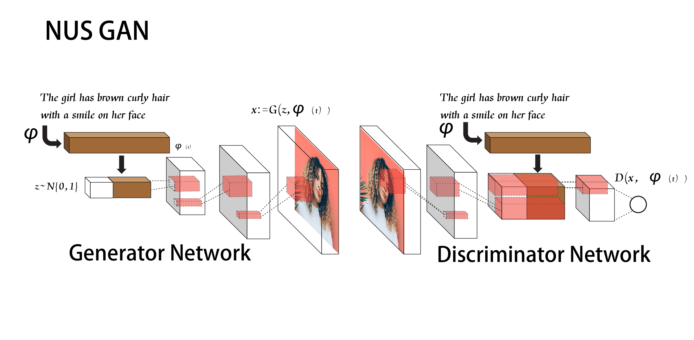
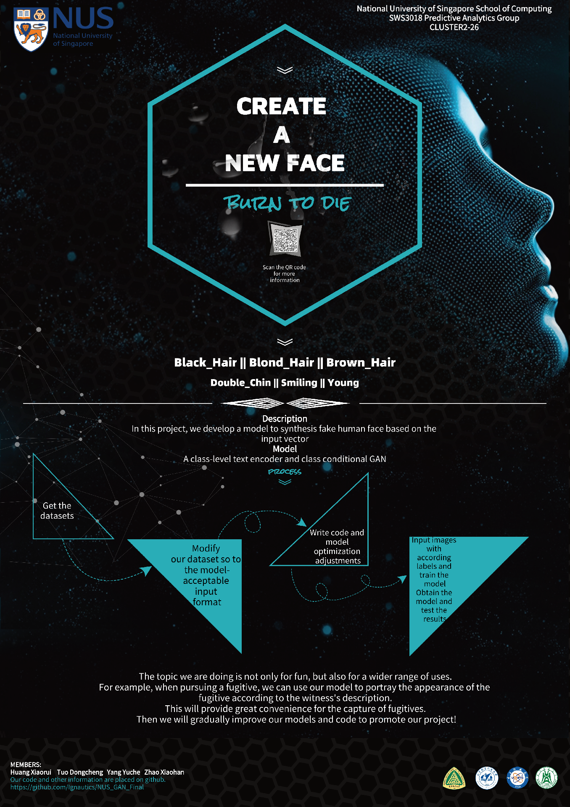

# vector-to-image using condition-gan【NUS_GAN】
## Overview
This is a tensorflow implementation of generating face images using condition-GAN named NUS_GAN. We've gotten great progress on the basis of [DCGAN](https://github.com/carpedm20/DCGAN-tensorflow) after using our algorithm. At present, this is just a preliminary version and coupled with our lack of ability, maybe there are still some problems in the codes. Please fell free to correct us.

The following is the model architecture. 

And the next picture is our prospective design, a temporary version.

The following is our poster.

## Requirements
- python3.6+
- tensorflow
- numpy 
- scipy
- matplotlib
- others

## Datasets
- The model is currently trained on the [celeb-dataset](http://mmlab.ie.cuhk.edu.hk/projects/CelebA.html). Considering the lack of computing power, we only selected 10,000 pictures for training, which number from ```000001.jpg``` to ```005000.jpg``` and ```010001.jpg``` to ```015000.jpg```. Download the images from [here](https://drive.google.com/open?id=1OBhGbYCgXVdTdGxZrDmO-ntsnPUhVaVr) and save them in ```data```.  Our trainging dataset includes the ```label.txt```. 

- Make empty directories, ```samples```, ```checkpoint```. They will be used for sampling the generated images and saving the trained models.

- You can also add your own dataset and transfer them to train the model, which is easy to modify.


## Usage
- Training
  * Basic usage `python3 train.py --train`
  * Options
    - `epoch`: Epoch to train[300]
    - `learning_rate`: Learning rate of for adam [0.0002]
    - `beta1`: Momentum term of adam [0.5]
    - `train_size`: The size of train images [np.inf]
    - `batch_size`: 50, "The size of batch images [50]
    - `input_height`: The size of image to use (will be center cropped). [218]
    - `input_width`: The size of image to use (will be center cropped). If None, same value as input_height [178]
    - `output_height`: The size of the output images to produce [218]
    - `output_width`: The size of the output images to produce. If None, same value as output_height [178]
    - `dataset`: The name of dataset [celeb]
    - `input_fname_pattern`: Glob pattern of filename of input images [*.jpg]
    - `checkpoint_dir`: Directory name to save the checkpoints [checkpoint]
    - `data_dir`: Root directory of dataset [./data]
    - `test_dir`: Root directory of test dataset [./test]
    - `test_dataset`: The name of test_dataset[test_in]
    - `test_out`: Directory name of test outputs[test_out]
    - `sample_dir`: Directory name to save the image samples [samples]
    - `train`: True for training, False for testing [False]
    - `crop`: True for training, False for testing [True]
    - `visualize`: True for visualizing, False for nothing [False]
    - `generate_test_images`: Number of images to generate during test. [100]
    
- Generating Images from Vectors
  * Write the vectors in text file, and save it as ```test/test_in/test_label.txt```. You can also download our test-dataset from [here](https://drive.google.com/open?id=1surDNUddnhMAHV0uvfkJjq1QWu0cRz0P). Generate the Images for the vectors using:
  ```
  python3 main.py
  ```
   ```vectors``` specifies the number of images to be generated per caption. The generated images will be saved in ```test/test_out/```. 
   
   On our dataset ```celeb```, the length of vectors is ```40```, each bit means ```yes``` or ```no``` from left to right. The concrete meaning from left to right list as follows:
 ```
 5_o_Clock_Shadow Arched_Eyebrows Attractive Bags_Under_Eyes Bald Bangs Big_Lips Big_Nose Black_Hair Blond_Hair Blurry Brown_Hair Bushy_Eyebrows Chubby Double_Chin Eyeglasses Goatee Gray_Hair Heavy_Makeup High_Cheekbones Male Mouth_Slightly_Open Mustache Narrow_Eyes No_Beard Oval_Face Pale_Skin Pointy_Nose Receding_Hairline Rosy_Cheeks Sideburns Smiling Straight_Hair Wavy_Hair Wearing_Earrings Wearing_Hat Wearing_Lipstick Wearing_Necklace Wearing_Necktie Young
 ```
 which ```1``` means ```yes``` and ```0``` means ```no```. You can get more details about label from [celeb-dataset](http://mmlab.ie.cuhk.edu.hk/projects/CelebA.html)

## Training process

## Pre-trained Models
- Download the pretrained model from [here](https://drive.google.com/open?id=1s0Uty5ZKcwhIK-V64V5iNIdTRDu-bgfY) and save it in ```checkpoint/celeb_50_218_178/```. You can choose one trained model to generate your images from ```checkpoint/celeb_50_218_178/``` by modifying file ```checkpoint```. 

- Our pre-trained Models are trained with ```dataset: celeb```, ```batch_size: 50```, ```output_height: 218``` and ```output_width: 178```. You can use this model for generating the images as long as you change these parameters as above.


## Sample Images Generated
Following are the images generated by the generative model from the vectors.

- Inputs: ```test_label.txt``` can be downloaded from [here](https://drive.google.com/open?id=1GhTx0D4jfHohK3Wjt0RowvxhgLSYdKPS).

- Outputs:


From the test results, we can see that our model probably restores the corresponding features, but there are still details to be perfected. If we have enough computing power, we believe that we can generate enough realistic and qualified faces.


## Implementation Details
- For Generator and Discriminator, we select different activity functions, namely ```Relu``` and ```LRelu```.
- For Discriminator, we weight the loss of the regression part and the loss of the image judgment part to obtain the final loss. The definition of ```d_loss``` is as follows:
```
self.d_loss = self.d_loss_real + self.d_loss_fake + self.L2_lambda2 * (self.y_loss_real + self.y_loss_fake)
```
Here, the value of ```self.L2_lambda2``` is 50.
- For Generator, we also deal with the same way as Discriminator, only the meaning of the expression is different.
```
self.g_loss = tf.reduce_mean(tf.nn.sigmoid_cross_entropy_with_logits(logits=self.D_fake_logits, labels=tf.ones_like(self.D_fake))) + self.L1_lambda * tf.reduce_mean(tf.abs(inputs - self.G))
```
Here, the value of ```self.L1_lambda``` is 100.
 - While training the model, we will random the training data every training epoch to ensure that all data can be added to the training process.
 - While processing the images before training, we've normalized the value from (0, 256) to (-1, 1). With this change in mind, the activity function used in the last layer of our generator is ```tf.nn.tanh```, not ```tf.nn.sigmoid```. It turns out that the effect is better.

## References
- [Text to image synthesis using thought vectors](https://github.com/paarthneekhara/text-to-image) Code
- [A tensorflow implementation of "Deep Convolutional Generative Adversarial Networks"](https://github.com/carpedm20/DCGAN-tensorflow) Code
- [celeb-dataset](http://mmlab.ie.cuhk.edu.hk/projects/CelebA.html) Dataset
